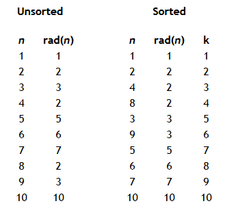

# Prix pour un jeu de disques
`Difficulté : Moyen (35%)`
`Origine : Projet Euler n°121`

Un sac contient au départ un disque rouge et un disque bleu. Un joueur choisit au hasard un disque et la couleur tirée est notée. Après chaque tour, le disque est remis dans le sac et un disque rouge est rajouté puis un nouveau disque est choisi au hasard. On répète ainsi un certain nombre de tours.

Le joueur paye 1 euro  pour jouer et gagne s'il a obtenu strictement plus de disque bleus que de rouges à la fin du jeu.

Si le jeu est joué en 4 tours, la probabilité pour un joueur de gagner est exactement 11/120 et le récompense maximum que la banque doit donner pour une victoire est de 10 euros pour qu'elle reste gagnante. Notons que la récompense doit être un nombre entier d'euros et inclure l'euro payé pour jouer au jeu. Ainsi, dans l'exemple donné, le joeur gagne en réalité 9 euros.

Trouver la récompense maximum que la banque doit offrir pour un jeu de 15 tours.

On affichera le résultat avec `print`.

@[Prix pour un jeu de disques]({"stubs": ["Defis/Euler_121.py"], "command": "python3 Defis/Euler_121_Test.py"})

---

# Calculs de puissances efficaces
`Difficulté : Moyen (40%)`
`Origine : Projet Euler n°122`

La méthode la plus naïve pour calculer $`n^{15}`$ requière 14 multiplications :

$`n\times n \times n\times ... \times n = n ^{15}`$.

Mais en utilisant la méthode binaire, on peut calculer en six multiplications : 

$`n × n = n^2`$  
$`n^2 × n^2 = n^4`$  
$`n^4 × n^4 = n^8`$  
$`n^8 × n^4 = n^{12}`$  
$`n^{12} × n^2 = n^{14}`$  
$`n^{14} × n = n^{15}`$  

Cependant, il est possible de calculer avec seulement 5 multiplications : 

$`n × n = n^2`$  
$`n2 × n = n^3`$  
$`n^3 × n^3 = n^6`$  
$`n^6 × n^6 = n^{12}`$  
$`n^{12} × n^3 = n^{15}`$  

On peut définir m(k) comme le nimbre minimum de multiplications pour calculer $`n^k`$. Par exemple, on a vu : m(15)=5

Pour 1 ≤ k ≤ 200, Trouver la somme des m(k).

On affichera le résultat avec `print`.

@[Calculs de puissances efficaces]({"stubs": ["Defis/Euler_122.py"], "command": "python3 Defis/Euler_122_Test.py"})

---

# Reste de carré de nombres premiers
`Difficulté : Moyen (30%)`
`Origine : Projet Euler n°123`

On pose $`p_n`$ le n-ième nombre premier et r le reste de la division euclidienne de $`(p_n-1)^n+(p_n+1)^n`$ par $`p_n^2`$.

Par exemple, quand n = 3, $`p_3=5`$ et $`4^3+6^3 = 280 \equiv 5 [25]`$.

La plus petite valeur de n pour laquelle le reste dépasse pour la première fois $`10^9`$ est 7037.

Trouver la plus petit valeur de n pour laquelle le reste dépasse pour la première fois $`10^{10}`$.

On affichera le résultat avec `print`.

@[Reste de carré de nombres premiers]({"stubs": ["Defis/Euler_123.py"], "command": "python3 Defis/Euler_123_Test.py"})

---

# Radicaux ordonnés
`Difficulté : Moyen (25%)`
`Origine : Projet Euler n°124`

Le radical de n, rad(n) est le produit des facteurs premiers distincts de n. Par exemple, $`504=2^3 \times 3^2 \times 7`$ donc $`rad(504)= 2\times 3 \times 7= 42`$.

Si on calcule rad(n) pour 1 ≤ n ≤ 10, et qu'on les ordonne selon rad(n) et selon n si les radicaux sont égaux, on obtient :

Si on pose E(k) le k-ième élément dans la colonne des n triés, on a par exemple E(4) = 8 et E(6) = 9.

Si rad(n) est trié pour 1 ≤ n ≤ 100000, trouver E(10000).

On affichera le résultat avec `print`.

@[Radicaux ordonnés]({"stubs": ["Defis/Euler_124.py"], "command": "python3 Defis/Euler_124_Test.py"})

---
