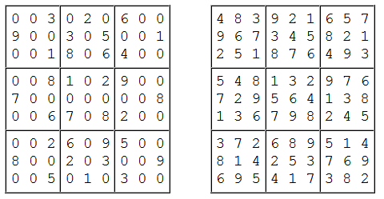

# Su Doku
`Difficulté : Moyen (25%)`
`Origine : Projet Euler n°96`

Su Doku est le nom donné à un concept de puzzle populaire. Son origine n'est pas claire, mais le crédit peut être attribué à Leonhard Euler qui inventa un puzzle similaire et beaucoup plus difficile appelé carrés latins. L'objectif d'un Su Doku est de remplacé tous les blancs (ou les zéros) d'une grille 9 par 9 tels que chaque ligne, colonne et bloc 3 par 3 ne contienne qu'un seul chiffre de 1 à 9. Ci dessous un exemple d'une grille de départ et de sa solution.

Une grille de Su Doku bien construite a une unique solution et peut-être résolue par logique, cependant, il peut être necessaire de deviner et tester des chiffres pour éliminer des options. La complexité de la recherche détermine la difficulté du puzzle. L'exemple ci dessus est considéré comme facile car il peut être résolu par une déduction directe.

On donne ci-dessous une liste de 50 grilles (sous forme de tableau 9 par 9) rangées par difficulté ayant chacune une unique solution. Le premier de la liste est celui présenté en exemple ci-dessus.

En résolvant les 50 grilles, trouver la somme des nombres de 3 chiffres qui se trouve dans le coin supérieur gauche de chaque grille. Par exemple 483 est le nombre de 3 chiffres qui se trouve dans la grille solution de l'exemple.

On affichera le résultat avec `print`.

@[Su Doku]({"stubs": ["Defis/Euler_96.py"], "command": "python3 Defis/Euler_96_Test.py"})

---

# Grand nombre premier qui n'est pas un nombre de Mersenne
`Difficulté : Facile (5%)`
`Origine : Projet Euler n°97`

Le premier nombre premier trouvé excedant un million de chiffre a été découvert en 1999 et est un nombre de Mersenne premier de la forme $`2^{6972593}−1`$; Il contient exactement 2,098,960 chiffres. Ensuite, un autre nombre de Mersenne premier a été trouvé contenant davantage de chiffres.

Cependant, en 2004, il a été trouvé un énorme nombre premier qui n'est pas de Mersenne contenant 2,357,207 chiffres : $`28433×2^{7830457}+1`$.

Trouver les 10 derniers chiffres de ce nombre premier.

On affichera le résultat avec `print`.

@[Grand nombre premier qui n'est pas un nombre de Mersenne]({"stubs": ["Defis/Euler_97.py"], "command": "python3 Defis/Euler_97_Test.py"})

---

# Carrés et anagrammes
`Difficulté : Moyen (35%)`
`Origine : Projet Euler n°98`

En remplaçant chaque lettre du mot CARE par 1,2,9 et 6 respectivement, on forme le nombre carré 1296=36². Ce qui est remarquable est qu' en utilisant la même substitution, l'anagramme RACE forme aussi un carré : 9216=96². On appellera CARE et RACE des une paire d'anagrammes carrées. On précise que les zéros en début de nombre ne sont pas permis ni la possibilité d'avoir plusieurs lettres associées à un même chiffre.

En utilisant la liste de mots usuels anglais donnée ci-dessous, trouver toutes les paires d'anagrammes carrées (un palindrome n'est pas considéré comme une anagramme de lui même ici) et donner le plus grand carré possibleformé à partir d'un des membres d'une paire de ces anagrammes carrées.

NOTE: Chaque anagramme formée doit faire partie de la liste des mots donnée.

On affichera le résultat avec `print`.

@[Carrés et anagrammes]({"stubs": ["Defis/Euler_98.py"], "command": "python3 Defis/Euler_98_Test.py"})

---

# Puissance la plus grande
`Difficulté : Facile (10%)`
`Origine : Projet Euler n°99`

En comparant deux nombres écrits sous la forme $`2^{11}`$ et $`3^7`$ n'est pas difficile et n'importe quel calculateur pourra confirmer que $`2^11=2048 < 3^7=2187`$

Cependant, confirmer que $`632382^{518061} > 519432^{525806}`$ peut être beaucoup plus difficile car les deux nombres ont plus de trois millions de chiffres.

En utilisant la liste donnée ci-dessous composée de mille couples sous la forme (base,exposant), déterminer quelle ligne a la plus grande valeur numérique.

On affichera le résultat avec `print`.

@[Puissance la plus grande]({"stubs": ["Defis/Euler_99.py"], "command": "python3 Defis/Euler_99_Test.py"})

---

# Probabilité arrangée
`Difficulté : Moyen (30%)`
`Origine : Projet Euler n°100`

Si une boite contient 21 disques de couleur, conposé de 15 disques bleus et six disques rougeset qu'on prend au hasard 2 disques, on peu voir que la probabilité de prendre 2 disque bleus est $`P=\dfrac{15\times14}{21\times 20}=\dfrac 1 2`$.

Le prochain arrangement pour lequel il y a exactement 50% de chance d'avoir deux disques bleus en tirant deux disques au hasard se produit lorsque la boite contient 85 disques bleus et 35 disques rouges.

En trouvant le premier arrangement qui cntient $`10^{12}=1 000 000 000 000`$ disques en tout, déterminer le nombre de disques bleus que la boite contient.

On affichera le résultat avec `print`.

@[Probabilité arrangée]({"stubs": ["Defis/Euler_100.py"], "command": "python3 Defis/Euler_100_Test.py"})

---
