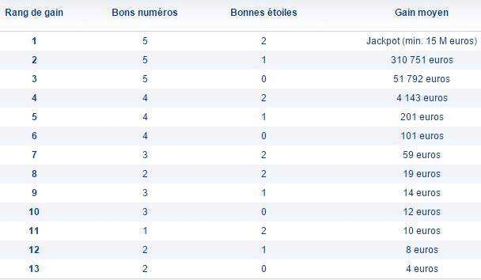

# Simulations de l'Euromillion

Le but de cette page est de simuler nos potentiels gains à l'Euromillion après un certain nombre de tirages. Je rappelle que la loi interdit les jeux d'argent aux moins de 18 ans et peuvent qu'ils peuvent causer des addictions etc. mais normalement, après avoir fini les simulations sur cette page, cela devrait vous convaincre qu'il ne vaut mieux pas jouer.

Commençons par rappeler les règles : On choisit 5 numéros entre 1 et 50 (compris) ainsi que 2 étoiles (deux nombres entre 1 et 11 compris). Un tirage est effectué et en fonction du nombre de bons numéros et étoiles, on gagne une certaine somme. Le prix d'un ticket est de 2,50 euros.

Nous allons créer au fur et à mesure les fonctions necessaires à nos simulations.

## Simuler un tirage

Commençons par simuler un tirage de 5 numéros (entre 1 et 50 compris) et deux étoiles (entre 1 et 11 compris).

Pour cela, l'idée est simple : On s'intéresse d'abord aux 5 premiers numéros, on choisit un numéro au hasard (avec la fonction `randint` du module `random`), on met notre numéro dans la liste nommée `tirage` et on recommence 5 fois. Le problème c'est qu'en choisissant au hasard, on peut tomber plusieurs fois sur les mêmes numéros donc si c'est le cas, il faut relancer tant qu'on a pas un nouveau numéro. Puis on fait de même avec les étoiles.

Compléter la fonction `tirages()` ci-contre pour qu'elle renvoie un tirage de l'Euromillion puis appuyer sur Run ci-dessous pour voir si elle fonctionne correctement.

@[ ]({"stubs":["TP/Euromillion.py"], "command": "python3 TP/tirages_Test.py", "layout": "aside"})

---

## Compter le nombre de bons numéros

A présent intéressons nous aux nombres de bons numéros et étoiles qu'on a obtenu après un tirage.

Créer une fonction `resultat(mes_numeros,mes_etoiles,tirage,etoiles)` qui prend en entrée la liste de mes 5 numéros, la liste de mes 2 numéros étoile, la liste des 5 numéros du tirage et la liste des 2 numéros étoiles tirés et donne en sortie le nombre de bons numéros obtenus suivi (séparé par une virgule) du nombre de bonnes étoiles obtenues.

> Exemple : `resultat([1,2,3,4,5],[6,7],[2,4,6,8,10],[7,11])` doit renvoyer `2,1` car il y a deux bons numéros (le 2 et le 4) et une bonne étoile (le 7).

Tester votre fonction en appuyant sur Run ci-dessous

@[ ]({"stubs":["TP/Euromillion.py"], "command": "python3 TP/resultat_Test.py", "layout": "aside"})

---

## Donner le gain

Maintenant qu'on sait obtenir le nombre de bons numéros et de bonnes étoiles qu'on a, il faut déterminer le gain. Pour cela, voici le tableau des gains de l'Euromillion (On prendra 15 million pour le gain maximum) :


Voici le début de la fonction `donner_gain(n,e)` qui prend en entrée le nombre ***n*** de bons numéros et ***e*** de bonnes étoiles.

Copier-oller le début du code ci-dessous dans la fenêtre ci-contre puis le compléter pour que tous les gains soient pris en compte. Ne pas oublier de renvoyer 0 s'il n'y a pas de gains.

``` python
def donner_gain(n,e) :
    if n == 5 :
        if e == 2 : return 15000000
        elif e == 1 : return 310751
        else : return 51792
    elif n == 4 :
        if e == 2 : return 4143
        ...
        
```

@[ ]({"stubs":["TP/Euromillion.py"], "command": "python3 TP/gain_Test.py", "layout": "aside"})

---

## Les simulations

Il est temps de passer aux simulations. 

Voici la fonction pour simuler des tirages à partir des fonctions précédentes. Quelques explications :
On fait `nb_simulations` simulations. A chaque fois, on regarde le gain relatif (on soustrait le prix du ticket) qu'on a fait et on l'ajoute à `total_gains` pour savoir combien on a gagné en tout.  
Au passage, on affiche lorsque le gain est remarquable ( plus grand que 100 euros) pour voir que ce n'est pas très fréquent.

```
def simulation() :
    total_gains = 0
    for i in range(nb_simulations):
        tirage,etoiles = tirages()
        n, e = resultat(mes_numeros,mes_etoiles,tirage,etoiles)
        gain = donner_gain(n,e) - prix_ticket
        if gain > 100 :
            print("Au tirage n° {}, j'ai gagné {} euros".format(i,gain))
        total_gains += gain
    print("Au final, j'ai gagné {} en {} tirages ce qui fait une moyenne de {} par tirage".format(total_gains,nb_simulations,total_gains/nb_simulations))
```
    
Copier coller le code ci-dessous à la suite de vos fonctions puis appuyer sur Run ci-dessous pour voir le résultat. Vous pouvez modifier la liste ***mes_numeros*** et ***mes_etoiles*** ainsi que le nombre de simulations.

@[ ]({"stubs":["TP/Euromillion.py"], "command": "python3 TP/simulations_Test.py", "layout": "aside"})

---

## Prolongement possible

Vous pouvez créer un programme qui cherche au bout de combien d'essais on gagne enfin le jackpot. Pour cela, il faudra utiliser un éditeur externe (Edupython par exemple) car c'est trop long pour ce site mais vous pouvez copier coller les fonctions que vous avez déjà faites.

Et pour que ça soit plus pertinent, il faudrait savoir en moyenne tous les combiens d'essais on gagne le jackpot. Prévoir une petite nuit de calculs...
